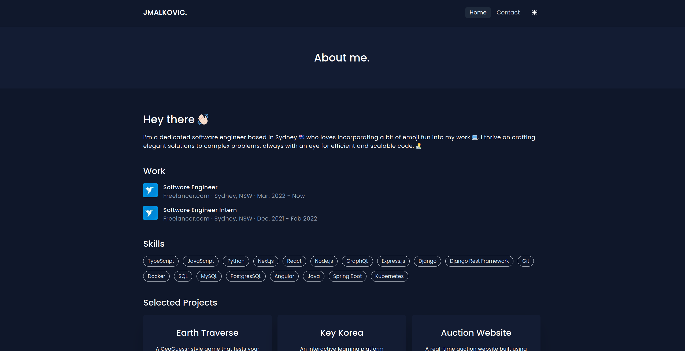

<h1 align="center">My Portfolio Website</h1>

<h3 align="center">
  <a href="https://www.jarrodmalkovic.com/">Visit the live app</a> |
  <a href="https://github.com/JarrodMalkovic/portfolio-website/issues">Report Bug</a> |
  <a href="https://github.com/JarrodMalkovic/portfolio-website/issues">Request Feature</a>
</h3>



## 📝 Table of contents

- [Run Locally](#-run-locally)
- [Technologies](#-technologies)
- [License](#-license)

## 🚀 Run Locally

### Clone repo to your local machine

```bash
git clone git@github.com:JarrodMalkovic/portfolio-website.git
```

### Install the required development dependencies

```bash
yarn
```

### Start the local development server

```bash
yarn dev
```

### Run in browser

Open `https://localhost:3000` in your browser.

## 💻 Technologies

This project is is created with:

- TypeScript, Next.js, React, TailwindCSS, GraphQL, Hygraph, Sentry and deployed to Vercel.

## ⚖️ License

This project is licensed under the MIT License

<hr>

<h3>
  <a href="https://www.jarrodmalkovic.com/">Visit the live app</a> |
  <a href="https://github.com/JarrodMalkovic/portfolio-website/issues">Report Bug</a> |
  <a href="https://github.com/JarrodMalkovic/portfolio-website/issues">Request Feature</a>
</h3>
